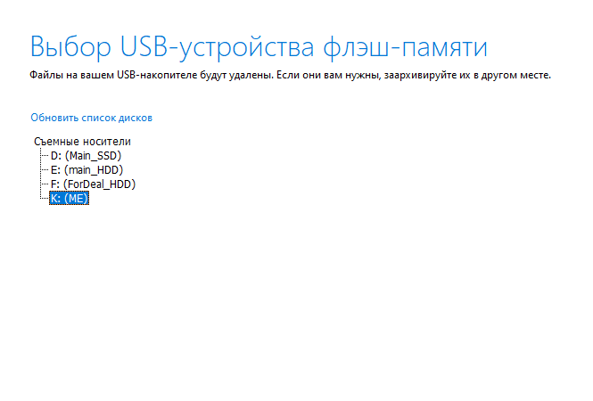
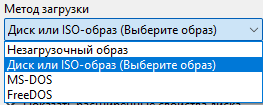

# README

Гайд по загрузке и созданию установочной флешки с Windows системой.

---

### Media Creation Tool

1. Разархивировать `MediaCreationTool.bat-main.zip`
2. В папке с программой запустить `MediaCreationTool.bat`

   *Откроется консоль и окно программы*
   
3. В окне программы выбираем необходимую версию (не ниже 22H2), после чего открываеся другое окно.
4. Нажимаем "**Select**" и открывается окно загрузки или эта же программа.

   

   > **Если эта программа открылась, то повторить те же действия с выбором версии винды.**
   >
5. В открывшемся окне устновщика, выбираем язык, выпуск (с Home достаточно) и жмем далее

   
6. Далее, на следующей странице, выбираем способ загрузки. Лучше выбрать "**USB**", т.к. из `.iso` файла придется делать загрузочную флешку.

   

   > **Если выбрать iso-образ, то, на следующей странице, предложат выбрать путь загрузки.**
   >

   
7. Выбираем нашу флешку и жмем "**Далее**".

   
8. Ждем окончания загрузки ОС.

   
9. **PROFIT!**

   > **!ВАЖНО!** При создании загрузочной флешки, не проморгай момент с форматированием флешки, иначе установочник поломает определение файловой системы и придется заного все распределять.
   > *Если имеется страх, то лучше выбрать загрузку в формате `.iso`.*
   >

   ---

### Rufus

Если было сделано решение или пришлось качать образ `.iso`, то из него надо сделать установщик, т.е. создать загрузочную флешку.

1. Открываем программу "Rufus.exe"

   
2. В пункте "**Устройство**" выбираем нашу флешку.
3. В пункте "**Метод загрузки**" выбираем "Диск или ISO-образ", после чего жмем на кнопку "**ВЫБРАТЬ**"

   
4. В открывшимся окне проводника, находим наш образ и выбираем его, затем жмем кнопку "**Открыть**"

   
5. Далее, в пункте "**Схема раздела**" выбираем GPT, если у нас новая материнская плата с поддержкой UEFI или MBR, если у нас новая материнская плата

   

   > У многих современных материнских плат, в настройках BIOS, стоит Legacy mode, что вынуждает выбирать метод MBR. Если нет уверености, что поучится найти и изменить на UEFI only, то смело выбираем MBR и не паримся (И на оборот).
   >

   * В пункте "Новая метка тома" можно написать желаемое название для флешки, но, важно, чтобы использовались только символы латиницы;
   * Если нажать на сплывающее меню "Показать расширенные свойства диска", то можно выбрать пункт "Добавить исправления для старых BIOS", если выбрана схема раздела MBR.
6. Далее, жмем "**СТАРТ**" и, в открывшимся окне, выбираем первые два пункта, затем жмем "**ОК**"

   

   > Остальные пункты выбираем по желанию, но последний пункт (нижний) не трогаем.
   >
   > *P.S. Не всегда эти настройки срабатывают, из-за чего приходится все это выполнять во время установки.*
   >
7. Затем, откроется окно с предупреждением о дальнейшем форматировании флешки. Жмем "**ОК**"

   
8. Ждем завершение процесса создания загрузочной флешки. По окончанию процесса, закрываем программу.
9. PROFIT!
